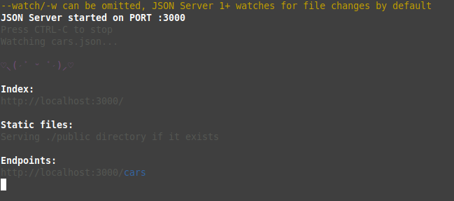

## HTTP Simplificado com módulo requests

Neste diretório, decidi praticar a comunicação de um servidor web usando JSON. Era necessário dois conceitos, o servidor (que serve um serviço web) e a ferramenta (que se comunica com o servidor).

O servidor era a primeira coisa a ser pensada e resolvida, então acabei usando o meu próprio servidor HTTP privado, que funcionará apenas para mim e desempenhará com sucesso o papel de base da API RESTFul. Decidi usar um pacote gratuito e aberto chamado **json-server**, implementado em cima do ambiente *Node.js*.

### Instalação do Node.js & JSON-server

Primeiro, precisamos ter o Node.js instalado em nosso computador. Os passos que você deve seguir dependem do sistema operacional que você usa. Então... se você é um usuário Linux, tal como eu, você tem que ir ao endereço https://nodejs.org/en/download/package-manager e obter alguma assistência mais específica.

Depois de instalar tudo, você pode usar o **npm**, o gerenciador de pacotes. Instale o `json-server`, rodando:

```bash
npm install -g json-server
```

Para testar que o servidor está funcionando podes baixar o ficheiro neste mesmo diretório que é `cars.json`. Depois rode:

```bash
json-server --watch cars.json
```

Se aparecer tal como na imagem, o servidor está funcionando:



### Testando no navegador o servidor

Abra o teu navegador e digite: `http://localhost:3000`

Se não fosse especificado o recurso, apareceria uma tela de boas-vindas, mas já configurei tudo.

## Módulo requests

Rode o script python **requests_test.py**. Lá detalhei de forma técnica e simples o funcionamento geral do projecto. Super recomendo a [edube](https://www.edube.org) para fazeres os cursos de Python ou Desenvolvimento Web, juntos!!!

### CRUD com módulo requests

Os exercícios estão organizados em `json-server`.